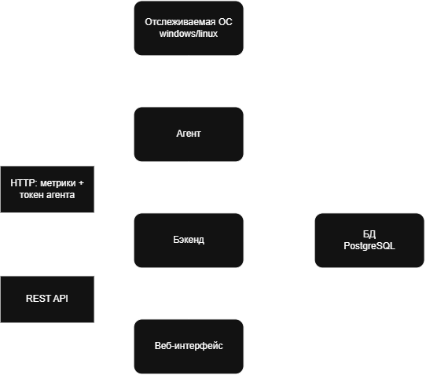

# Описание сервиса

Сервис для мониторинга компьютеров и серверов. Агент собирает метрики (показатели CPU, RAM, файловой системы и выбранных служб), после чего отправляет собранные данные на сервер (бэкенд) и тот уже их сохраняет и предоставляет их для просмотра через веб-интейрфейс.

<!--    -->

## Возможности

### Агент 

Агент может собирать метрики отслеживаемой ОС:
 - CPU (сбор проходит в процентах)
 - RAM (информация общего объема и занятого)
 - файловая система (информация о всех доступных дисках и их общий и занятого объем)
 - службы/сервисы (информация о статусе выбранных служб)

Агент поддерживает сборку метрик как на windows, так и linux системах

### Передача метрик на сервер

На сервере нужно создать новое устройство и ввести **Название** и **Токен агента**, после чего агент сможет отправлять данные.

Агент отправляет метрики на сервер с заголовком `X-Agent-Token`, сервер на своей стороне проверяет токен, если все так, то данные сохраняются.

### как это все работает



Серверная часть разворачивается на выбранном компьютере или сервере, агенты — на наблюдаемых устройствах

## Развертывание

### Запуск сервиса 

- Для того чтобы запустить бэкенд+фронтенд+БД, вам нужно иметь на копмьютере docker. 
- Скачать все для развертывания [Скачать тут](https://github.com/uz3ix/Monitoring-Service-MIREA/releases/download/v0.1.0/service-files.zip).
- Скопировать `.env.example` в `.env` и дополнить его своими настройками
- Запустить `docker compose up -d` (образы сами спулятся, так что отдельно их устанвливать не надо)
- Открыть интерфейс и добавить новое устройство.

### Подключение агента или его запуск

Перед запуском запустите серверную часть об этом [тут](#запуск-сервиса)


#### Windows 

[Скачать тут](https://github.com/uz3ix/Monitoring-Service-MIREA/releases/download/v0.1.0/windows-agent.zip)

Распаковываем архив
Дописываем нужные настройки в `.env`
Откройте PowerShell в папке агента.
Проверить сбор без отправки:
```
.\monitoring-agent.exe --collect-only
```

Отправить одно измерение:
```
.\monitoring-agent.exe --once
```

Если появилось сообщение **«Метрики отправлены»**, запустите постоянную работу:
```
.\monitoring-agent.exe
```

#### linux

[Скачать тут](https://github.com/uz3ix/Monitoring-Service-MIREA/releases/download/v0.1.0/linux-agent.zip)

Распаковываем архив 
Дописываем нужные настройки в `.env`
Откройте терминал в папке агента и разрешите запуск:
```
chmod +x monitoring-agent
```

Проверить сбор без отправки:
```
./monitoring-agent --collect-only
```

Отправить одно измерение:
```
./monitoring-agent --once
```

Запустить постоянную работу:
```
./monitoring-agent
```

Самое главное понимать, что если вы указываете в настройках `.env` 127.0.0.1 это будет работать только для агента, который запущен на том же компьютере где и бэкенд.

# Документация разработки 
 - [Ссылка на readme бэкенда](https://github.com/uz3ix/Monitoring-Service-MIREA/tree/backend/dev/backend)
 - [Ссылка на общую инструкцию бэкенда/агента](https://github.com/uz3ix/Monitoring-Service-MIREA/blob/weeks/2/reports/week2/Отчет_Н2.md)

# Скачать

[Агент windows](https://github.com/uz3ix/Monitoring-Service-MIREA/releases/download/v0.0.1-api/windows-agent.zip)
[Агент linux](https://github.com/uz3ix/Monitoring-Service-MIREA/releases/download/v0.0.1-api/linux-agent.zip)
[Сервис](https://github.com/uz3ix/Monitoring-Service-MIREA/releases/download/v0.0.1-api/service-files.zip)

# Выполнили

Группа: ЭФБО-08-24

- Демидов Иван
- Хинчагов Руслан
- Верхов Арсений
- Шевченко Вероника

