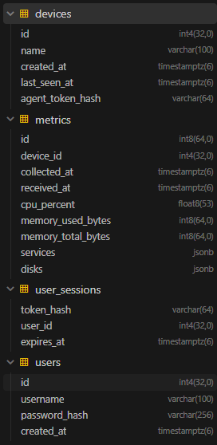

# Неделя 2 

## Разработка Агента

[Ссылка на код agent](https://github.com/uz3ix/Monitoring-Service-MIREA/tree/agent/dev)

### Цель 

Разработать программу для ее запуска на отслеживаемом устройстве, для дальнейшего сбора информации [(метрик)](#настройки) и отправления их на сервер.

### Структура программы 

`config.py` - Чтение настроек из переменного окружения (.env)
`collector.py` - Сбор показателей 
`client.py` - Отправка JSON на сервере за счет httpx
`main.py` - Вход в программу, цикл для сбора и отправки метрик 

### Собираемые данные

| Поле | Содержание |
| --- | --- |
| `collected_at` | Время формирования измерения |
| `cpu_percent` | Общая загрузка CPU, наблюдаемая ОС за секунду измерения |
| `memory_used_bytes` | Используемая память: `memory.total − memory.available` |
| `memory_total_bytes` | Общий объём памяти, доступный наблюдаемой ОС |
| `disks` | Список доступных файловых систем: точка монтирования, занятый и общий объём |
| `services` | Словарь состояний выбранных служб (Содержит статусы служб) |

Для сбора данных используется библиотека `psutil`. Если каких-то данных нет, то возвращается None. 

### Службы

ОС определяется через `platform.system()`. В Windows состояние служб запрашивается через psutil, а в linux `systemctl show`. Агент различает запущенную, остановленную, отсутствующую службу. Если сервис не доступен в linux ответ будет `unknown`, в Windows при отказе доступа `access_denied`. 

В будущем можно реализовать наблюдение за отдельными контейнерами. Сейчас можно лишь проверить работу docker.

### Настройки 

| Настройка | По умолчанию | Назначение |
| --- | --- | --- |
| `SERVER_URL` | Обязательный параметр | Адрес серверного API |
| `AGENT_TOKEN` | Обязательный параметр | Токен устройства |
| `SEND_INTERVAL_SECONDS` | 30 | Пауза после завершения цикла |
| `REQUEST_TIMEOUT_SECONDS` | 5 | Настройка таймаутов HTTPX |
| `SERVICE_NAMES` | [] | JSON-массив имён служб |

### Запуск

Планируется сделать запуск агента через exe для Windows, а для linux ELF. Возможное дополнение это автозапуск вместе с системой

### Результат

Создана первая версия агента для сбора и отправки метрик из windows/linux на сервер JSON запросами. Для запуска нужно настроить [env](#Настройки).

## Разработка Backend

[Ссылка на код backend](https://github.com/uz3ix/Monitoring-Service-MIREA/tree/backend/dev)

### Цель 

Разработать API для приема показателей и для предоставления данных и истории. Обеспечить хранение данных в PostgreSQL и запуск через docker

### Структура хранения

### Обработка измерений 

Сервер првоеряет диапозон загрузки CPU, неотрицательные значения метрик, отвечающих за объем данных, соотношение занятого и общего объема. 

В переменных окружениях можно задать сколько будут храниться данные (по умолчанию 7 дней), а устройство будет считаться online, если от него приходили данные в течении 180 секунд по умолчанию, но это так же можно изменить в env

### Развертывание

Нужно запустить docker-compose.yaml, сначала запускается БД (PostgreSQL), после чего стартует бэкенд, который выполняет при старте `alembic upgrade head`. Позже добавим образ backend для самостояльного запуска бэкенд части

### Результат 

Подготовлена серверная часть, которая может принимать измерения от агента (созданного в БД или свагере), все метрики сохраняются в БД. 
