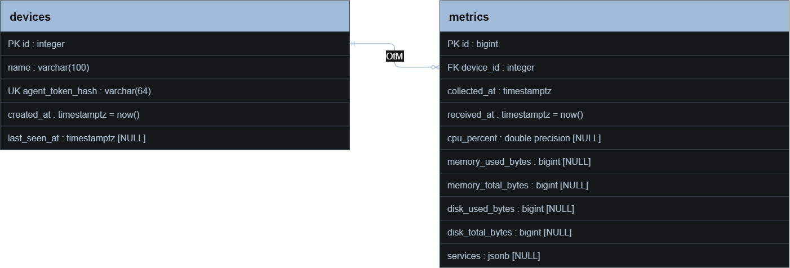

# Предпроектная аналитика сервиса мониторинга

## 1. Проблема проекта и что будет решать

Для наблюдения за несколькими устройствами (компьютерами, серверами) важно видеть нагрузку на поцессоры, использование памяти и работу диска, также важно видеть состояние выбранных служб в одном интерфейс. Так как проверка каждого компьютера вручную увеличивает затраченное время на проверку всех устройств и затрудняет поиск/анализ момента возникновения проблем.

В связи с этим мы хотим разработать сервис для просмотра текущих показателей компьютеров/серверов и истории изменений через сайт (браузер). Предполагаемые пользователи - это владельцы домашних мини-лабораторий, учебные команды и администраторы небольших компаний. 

Также будет возможность самостоятельного развертывания системы - пользователь сможет запустить собственный экземпляр сервиса из готовых Docker-образов и хранить данные внутри своей инфраструктуры. 

## 2. Что необходимо определить до разработки

До того как приступить к разработке нужно решить какой именно способ сбора метрик использовать в нашем проекте.

Существует 3 способа:
- push - агент сам отправляет данные на наш сервис
- pull - сервис обращается к агенту, чтоб забрать у него данные
- система использует доступные сетевые службы и протоколы без установки собственного агента. Возможности такого мониторинга зависят от настроек устройства и доступных источников данных

## 3. Сравнение способов получения данных

| Подход | Организация работы | Преимущества для проекта | Ограничения |
|---|---|---|---|
| push | На устройстве работает программа, которая периодически обращается к API сервера | Серверу не требуется устанавливать входящее соединение с каждым устройством, доступны локальные показатели ОС | Агент нужно устанавливать и обновлять, при сбое связи нужна политика хранения неотправленных данных |
| pull | Устройство предоставляет метрики, сервер запрашивает их по расписанию | Расписание опроса управляется централизованно, сервер наблюдает успех и ошибку каждого запроса | Нужна сетевая доступность точки сбора со стороны сервера, иногда через VPN или прокси, локальный сборщик всё равно может потребоваться |
| Проверки без агента | Используются HTTP, ICMP, SNMP или доступные средства удалённого управления | Для проверки доступности сайта может быть достаточно HTTP-запроса | Набор данных зависит от протокола и настроек, успешная HTTP-проверка сама по себе не показывает RAM и CPU компьютера |

**Предварительный выбор:** push-агент соответствует сценарию сбора локальных показателей с нескольких устройств. 

### 3.1. Подходы уже существующих решений

| Решение | Что подтверждает документация | Значение для проекта |
|---|---|---|
| Zabbix | Поддерживает активные и пассивные проверки агентов | Агентная архитектура - существующий подход, требуется обосновать выбор направления обмена данными |
| Prometheus | Основная модель сбора временных рядов - pull по HTTP | Даёт альтернативу самостоятельной отправке данных агентом |
| Grafana Alloy | Сборщик телеметрии, который получает и передаёт метрики, логи, трассировки и профили | Показывает возможность отделить сбор данных от их хранения и отображения |

На что опирались:
документация Zabbix [[1]](https://www.zabbix.com/documentation/current/en/manual/appendix/items/activepassive), обзор Prometheus [[2]](https://prometheus.io/docs/introduction/overview/), описание Grafana Alloy [[3]](https://grafana.com/docs/alloy/latest/introduction/)

В Grafana Alloy также используется отдельный сборщик, который получает и передаёт телеметрию. Этот пример показывает применение подхода с отдельным компонентом сбора данных в существующих решениях.

## 4. Предлагаемые требования к первой версии

| Компонент | Предлагаемые функции | Обоснование |
|---|---|---|
| Агент | Сбор загрузки CPU, использования RAM, заполнения диска и состояний выбранных служб, периодическая отправка показателей | Получение локальных показателей устройств |
| Сервер | Приём и проверка метрик, идентификация устройств, выдача истории | Централизованная обработка данных |
| Веб-интерфейс | Список устройств, последние показатели, графики за выбранный период | Просмотр состояния нескольких компьютеров в одном месте |
| Хранение | Сохранение времени измерения и времени приёма, ограниченный срок хранения | Анализ изменений и ограничение роста базы |
| Доступ | Авторизация пользователя и проверка права агента отправлять данные | Защита просмотра и записи метрик |
| Сбои передачи | Отображение отсутствия свежих данных и возобновление отправки после восстановления связи | Корректное поведение при недоступности сервера или устройства |
| Установка сервера | Готовые образы, Compose-файл, пример настроек и инструкция | Самостоятельное развёртывание экземпляра сервиса |

## 5. Самостоятельное развёртывание

Предлагаемая схема: **агенты на устройствах -> серверное API -> база данных**. Веб-интерфейс будет получать данные через API.

| Способ установки | Что потребуется от пользователя | Особенности |
|---|---|---|
| Ручная установка | Установить среду выполнения, зависимости, базу данных и настроить запуск | Позволяет управлять компонентами отдельно, но требует настройки их совместимости |
| Готовые контейнерные образы | Подготовить контейнерную среду, заполнить настройки и запустить Compose | Требует поддержки образов и порядка обновления |

Наш выбор - это готовые контейнерные образы. Вместе с готовыми образами будет: docker-compose файлы, примеры env-файлов и инструкция для первого запуска. 

Серверную часть и агент рассматриваем отдельно. Агент должен быть устанавлен непосредственно в наблюдаемой ОС.

## 6. Вывод

Для разрабатываемого сервиса будет использоваться агент, который будет собирать показатели компьютера/сервера и отправлять их на основной сервер сбора информации (подход push). Такой подход позволит просматривать состояние нескольких устройств и историю изменения показателей через единый веб-интерфейс. При этом серверу не потребуется устанавливать входящее соединение с каждым устройством.

Серверная часть будет доступна в виде готовых контейнерных образов. Пользователь сможет развернуть экземпляр сервиса с помощью docker compose, указав все необходимые параметры в .env, указанных в инструкции. Так как мы выбрали готовые образы, то пользователю не потребуется самостоятельно устанавливать зависимости для приложения и поднимать базу данных.

# Источники

- [[1]](https://www.zabbix.com/documentation/current/en/manual/appendix/items/activepassive) - документация к Zabbix 
- [[2]](https://prometheus.io/docs/introduction/overview/) - Prometheus
- [[3]](https://grafana.com/docs/alloy/latest/introduction/) - Grafana Alloy